# Enterprise Mobile Super-App Engineering Operating Model
### *A Practical, High-Scale Engineering Field Guide, Architectural Playbook, and Delivery Lifecycle*

---

## 1. Executive Summary & The 30-Second Quickstart

This document formalizes the end-to-end engineering, architecture, governance, sprint execution, release cadence, and quality frameworks for high-concurrency mobile super-applications. It provides a clear, high-velocity operating model while maintaining the **deep technical rigor** required for mission-critical telecom and fintech platforms.

### ⚡ The Five Golden Rules of Our Engineering Culture

```
  1. Box Before Build       ── Never start squad refinement without an architect's Box Solution blueprint.
  2. Lock at ARB            ── Cross-product architecture review (Core Products, Main Leads, POL/SOL) locks dev hours, QA hours, and release dates.
  3. Chunk to ≤ 4 Hours     ── Granular subtasks surface blockers within 24 hours at morning standups.
  4. Enforce 10% Bug Buffer ── Mathematically cap QA bug-fixing time to maintain sprint commitments.
  5. BE Freeze First        ── All backend microservices deploy to production BEFORE mobile sanity begins.
```

---

## 2. Plain-English Jargon Buster (The Super-App Glossary)

Standard terms keep squads aligned across engineering, product, and leadership:

| Term | Full Name | Plain-English Meaning | Real-World Analogy |
| :--- | :--- | :--- | :--- |
| **Box Solution** | Architectural Blueprint | A 1-page system diagram prepared by the Solution Architect during grooming. It defines touched microservices and the baseline Frontend/Backend effort split (e.g., 40% FE / 60% BE). | The blueprint an architect draws before builders buy materials. |
| **ARB** | Architecture Review Board | A regular cross-product panel of Team Leads, System Architects, Core Product Leads, and Main Product Leads (Core Products, Payments/POL, Subscriptions/SOL, and Platform Services). It reviews solution docs, checks edge cases, and locks Dev/QA estimates and release dates. | A building inspection board checking structural safety and fire code before issuing a permit. |
| **POL** | Payment Orchestration Layer | The central payment platform connecting digital wallets, cards, and banks with idempotency and retry safeguards. | A secure cashier terminal that accepts cash, cards, and vouchers safely. |
| **SOL** | Subscription Orchestration Layer | The central engine managing recurring packs, auto-renewals, billing cycles, and balance deduction fallbacks. | A recurring subscription service (like Netflix billing). |
| **STRIDE** | Threat Modeling Framework | A 6-part security checklist (Spoofing, Tampering, Repudiation, Info Disclosure, DoS, Elevation of Privilege) required for sensitive features. | A rigorous building security audit checking doors, locks, cameras, and alarms. |
| **TCAB** | Technical Change Advisory Board | The infrastructure governance council that reviews database migrations, configurations, and backend deployments. | Air traffic control approving takeoff slots and flight paths. |
| **Live Issue Pool** | Pre-Existing Defect Backlog | A shared backlog of legacy production bugs kept separate from new feature tickets so sprint deliveries stay on schedule. | A municipal road maintenance backlog for old potholes, kept separate from new highway projects. |
| **UAT Bug Leakage** | QA Quality Metric | The percentage of defects missed by Squad QA and caught later by business UAT testers. Target is $< 2\%$. | A water filter test: fewer impurities leaking through means higher quality. |

---

## 3. A Day in the Life of a Squad Engineer

This is how daily engineering rhythm operates in practice:

```
  09:30 AM ── Morning Standup (15 mins)
              • Report on yesterday's 4-hour subtasks.
              • Declare today's planned subtask.
              • Immediately raise blockers to your Scrum Master with [BLOCKER] tag.
  
  10:00 AM ── Deep Focus Dev Time
              • Work on your assigned Jira subtask (≤ 4 hours).
              • Connect to internal Dev Environment via secure VPN.
              • Implement business logic with automated unit tests (≥ 80% coverage).
  
  02:00 PM ── Code Review & Collaboration
              • Open PR on Git with clean description and screenshots.
              • Request reviews: 1 Senior Squad Peer + 1 Cross-Squad Specialist.
              • Review peer PRs adhering to clean-architecture guidelines.
  
  04:00 PM ── QA & Verification Cycle
              • Deploy merged code to the VPN-secured Dev Environment.
              • Hand off to Squad QA for feature verification.
              • If bugs are logged: track against your 10% bug-fixing allowance.
  
  05:30 PM ── Daily Time Entry Hygiene
              • Log actual hours in Jira: "Dev Time" (coding) vs "Refinement Time" (meetings).
              • Update subtask statuses (In Progress ➔ Done).
```

---

## 4. Organizational Topology & The 7-SPOC RACI Model

To maintain velocity while ensuring architectural coherence across microservices and mobile apps, teams operate within a hybridized **Spotify Squad Model with Matrix Governance**.

```
+---------------------------------------------------------------------------------------+
|                                    BUSINESS & UAT                                     |
|  - Product Owners (PO): Feature Vision, Business PRD, Metric Ownership               |
|  - UAT Team: Business Acceptance, Staging Verification, Go/No-Go Signoff              |
+---------------------------------------------------------------------------------------+
                                           ^
                                           |
+---------------------------------------------------------------------------------------+
|                                    TECH LEADERSHIP                                    |
|  - Solution Architect (SA): End-to-End System Design, Box Solutions, Tech Alignment   |
|  - Squad Main Lead: Technical Delivery, Resource Allocation; oversees 1 or more squads|
|  - Release Lead: Monthly Release Calendar, Sanity Orchestration, Store Operations     |
+---------------------------------------------------------------------------------------+
                                           ^
                                           |
+---------------------------------------------------------------------------------------+
|                 ARB: ARCHITECTURE REVIEW BOARD (CROSS-PRODUCT FORUM)                  |
|  - Joint Council of Leads, System Architects, and Product Leads across domains:      |
|    • Core Product Leads & Main Product Leads                                         |
|    • Payment Orchestration Layer (POL) Leads & Architects                            |
|    • Subscription Orchestration Layer (SOL) Leads & Architects                       |
|    • Core Platform Services & System Architects                                      |
+---------------------------------------------------------------------------------------+
                                           ^
                                           |
+---------------------------------------------------------------------------------------+
|                                   DEV SQUAD POOL                                      |
|  [Feature Squad 1]         [Feature Squad 2]        [Special Revamp / Core Squad]     |
|  - Squad Main Lead         - Squad Main Lead        - Cross-Squad Combined Taskforce  |
|  - Internal Dev Lead       - Internal Dev Lead      - Major Redesign / Refactoring    |
|  - Android Eng (Sr/Jr)     - Android Eng (Sr/Jr)    [Growth Squads]                   |
|  - iOS Eng (Sr/Jr)         - iOS Eng (Sr/Jr)        - Day-to-day business delivery    |
|  - Backend Eng             - Backend Eng            * Inter-Squad Loans: Engineers    |
|  - Squad QA Engineer       - Squad QA Engineer        can be temporarily borrowed for |
|  - Squad Scrum Master      - Squad Scrum Master       urgent high-priority features   |
+---------------------------------------------------------------------------------------+
```

### Team Roles & Staffing Mechanics

1. **Lead Team**:
   - **Solution Architect (SA)**: Prepares system blueprints ("Box Solutions"), defines microservice boundaries, and ensures cross-system integrity.
   - **Squad Main Lead**: Guides engineering delivery and resource allocation. A Squad Main Lead may oversee one or more squads.
   - **Release Lead**: Coordinates monthly store release dates, manages release candidate branches, and oversees store deployment operations.

2. **ARB (Architecture Review Board)**:
   - A joint council of Team Leads, System Architects, Core Product Leads, and Main Product Leads across key domains (Core Products, Main Product Leads, Payment Orchestration - POL, Subscription Orchestration - SOL, and Platform Services).
   - Validates technical feasibility, edge cases, and security controls, and permanently locks Dev and QA time estimates.

3. **Dev Squad Pool & Staffing Dynamics**:
   - **Squad Composition**: Each squad contains dedicated Frontend (Android & iOS), Backend (BE), Squad QA, an Internal Dev Lead, and is supported by a Squad Main Lead.
   - **Single Feature Ownership**: Each senior engineer takes end-to-end ownership of one main feature.
   - **Inter-Squad Loans**: When an urgent feature needs surge capacity, engineers can be temporarily borrowed between squads without red tape.
   - **Special Revamp Taskforces vs. Growth Squads**: For major app redesigns or core rewrites, senior engineers from multiple squads form a temporary taskforce. Meanwhile, Growth squads continue shipping daily business features.

4. **Scrum Masters (SM)**:
   - **Squad-Based SM**: Tracks daily subtasks, time logs, backlog health, standup updates, and blocker removal. One SM may serve multiple squads.
   - **Release SM**: Manages the monthly release candidate scope, tracks squad readiness, and prepares the pipeline for the next upcoming release.

---

### The 7-SPOC Ticket Ownership Contract
Every main Jira ticket binds 7 designated owners to eliminate ambiguity:

```
+--------------------------------------------------------------------------------------+
| MAIN JIRA TICKET TEMPLATE FIELDS                                                     |
+--------------------------------------------------------------------------------------+
|  [Core Metadata]                                                                     |
|  - Epic / Feature Name:      [e.g., Unified Payment Gateway Integration]             |
|  - Target Release Version:   [e.g., v2.4.0 - Monthly Release]                        |
|  - Component / Subsystem:    [POL / SOL / Core Mobile / Platform Services]           |
|                                                                                      |
|  [Accountability Matrix (RACI)]                                                      |
|  - 1. Product Owner (PO):    [Business Owner Name]       ➔ Owns PRD & Intent         |
|  - 2. Integration SPOC (SA): [Assigned Architect]        ➔ Owns Box Solution & ARB   |
|  - 3. Assignee (Dev Lead):   [Primary Feature Owner]     ➔ Owns Solution Doc & Code  |
|  - 4. Squad QA SPOC:         [Primary QA Engineer]       ➔ Owns Dev Env Test Plan    |
|  - 5. Scrum Master (SM):     [Assigned Squad SM]         ➔ Owns Blocker Resolution   |
|  - 6. UAT SPOC:              [Business QA Tester]        ➔ Owns Staging Acceptance   |
|  - 7. Code Reviewers:        [Senior FE, Senior BE]      ➔ Owns Architecture & PRs   |
|                                                                                      |
|  [Milestone Dates - Locked by ARB]                                                   |
|  - ARB Approval Date:        [YYYY-MM-DD]                                            |
|  - Dev Completion Target:    [YYYY-MM-DD]                                            |
|  - Staging / UAT Handover:   [YYYY-MM-DD]                                            |
|  - TCAB Submission Date:     [YYYY-MM-DD] (Backend Only)                             |
|  - Release Sanity Cutoff:    [YYYY-MM-DD]                                            |
+--------------------------------------------------------------------------------------+
```

> 💬 **Ticket Communication Rule:** All clarifications, technical questions, architectural decisions, and blocker notifications must be documented directly in the main Jira ticket comments with explicit `@mention` tagging of the designated SPOC. No critical decisions should remain hidden in private chat channels.

---

## 5. The 9-Stage Super-App Delivery Lifecycle

```mermaid
flowchart TD
    subgraph S1["Stage 1: Business Inception & Grooming"]
        A[PO Creates PRD Ticket] --> B[Grooming with SA Team]
        B --> C[SA Attaches Box Solution & Initial FE/BE Split]
        C --> D[Moved to: Ready for Squad]
    end

    subgraph S2["Stage 2: Squad Intake & Deep Refinement"]
        D --> E[Squad Pulls Ticket by Monthly Quota]
        E --> F[Dev Refinement: KT with PO & SA]
        F --> G[Draft Confluence Solution Doc]
        G --> H[Threat Modeling: STRIDE]
        H --> I[Granular Task Breakdown: 4h chunks]
    end

    subgraph S3["Stage 3: ARB Architecture Gateway"]
        I --> J[Book ARB Review Slot]
        J --> K{ARB Evaluation}
        K -- Needs Revision --> F
        K -- Approved --> L[Lock Dev/QA Estimations & Release Month]
    end

    subgraph S4["Stage 4: Sprint Execution"]
        L --> M[Dev Creates 4h Subtasks under Main Ticket]
        M --> N[Active Coding & Daily Time Logging]
        N --> O[Peer Code Review FE & BE]
    end

    subgraph S5["Stage 5: Squad QA & Defect Buffer"]
        O --> P[Deploy to Dev Environment]
        P --> Q[Squad QA Testing & Bug Ticket Issuance]
        Q --> R{Bug Time <= 10% Limit?}
        R -- Within Limits --> S[Squad QA Sign-off]
        R -- Exceeded --> T[Squad Lead Quality Alarm Review]
        T --> S
    end

    subgraph S6["Stage 6: UAT & Staging Deployment"]
        S --> U[Deploy to Staging Server via VPN]
        U --> V[Moved to UAT Backlog]
        V --> W[UAT Team Verification]
        W --> X{Defect Type?}
        X -- New Regression --> Q
        X -- Pre-existing Defect --> Y[Transfer to Live Issue Pool]
        W -- Approved --> Z[UAT Sign-off]
    end

    subgraph S7["Stage 7: TCAB & Deployment Freeze"]
        Z --> AA[BE Prepares TCAB Clearance]
        AA --> AB[TCAB Board Approval]
        AB --> AC[BE Production Deployment]
        AC --> AD[BE Freeze before Sanity Start Date]
    end

    subgraph S8["Stage 8: Branch Consolidation & Sanity"]
        AD --> AE[Squad Release Branches Merged into Sanity Candidate]
        AE --> AF[QA Pool Sanity Round]
        AF --> AG[UAT Pool Sanity Round & Final GO]
    end

    subgraph S9["Stage 9: Store Release & Observability"]
        AG --> AH[Staged Rollout: 5% -> 20% -> 50% -> 100%]
        AH --> AI[Firebase Crashlytics & APM Monitoring]
        AI --> AJ{Crash Spike?}
        AJ -- Normal --> AK[Release Milestone Completed]
        AJ -- Critical Issue --> AL[Hotfix Patch Release]
    end
```



### Stage-by-Stage Detailed Breakdown

#### Stage 1: PO Grooming & The Box Solution
- **PO PRD with Template**: The Product Owner initiates the feature request using a standardized Jira PRD template specifying business user journeys, acceptance criteria, analytics events, and business value.
- **Architectural Grooming**: Solution Architect (SA) team grooms the ticket with the PO. Refinement notes, technical clarifications, and architectural parameters are documented directly in the ticket comments.
- **The Box Solution Blueprint**: SA attaches a system boundary diagram to the ticket defining touched microservices (POL, SOL, Core Services) and sets the baseline effort distribution (e.g., 40% Frontend / 60% Backend).
- **Knowledge Transfer (KT)**: When necessary, the SA conducts an initial KT session with squad engineers to explain the architectural boundaries.
- **Queue Transition**: Once groomed and blueprint attached, the ticket transitions to `Ready for Squad`.

#### Stage 2: Squad Intake, KT & Confluence Refinement
- **Capacity Pulling**: Squads draw tickets from `Ready for Squad` into `Refinement in Progress` to fulfill their monthly sprint quota based on priority.
- **Urgent Priority Fast-Track**: High-priority business tasks may be injected directly by the Squad Lead with pre-locked estimations and hard delivery dates driven by business deadlines.
- **Squad Assignment & Initial KT**: Internal squad developers are assigned based on availability and FE/BE requirements. An initial squad meeting is held to absorb the KT and understand the ticket background.
- **Comment-Driven Clarification**: Any ambiguities, questions, or edge cases are commented on the main ticket with explicit `@mention` tagging of the SA or PO.
- **Confluence Solution Document**: Engineers author a formal engineering doc including:
  - System interaction flows and sequence diagrams.
  - Network failure matrices, retry policies, offline caching, and edge-case handling.
  - **STRIDE Threat Modeling** for security and fraud prevention.
  - **Blocker & Dependency Analysis**: Identifying prerequisite equipment, 3rd-party dependencies, and cross-team support.
  - Granular task decomposition into chunks of **$\le 4\text{ hours}$**.
- **Time Logging**: Time spent in this discovery and planning phase is logged strictly as `Refinement Time`.
- **Backlog Hygiene Rule**: Squads cannot hold tickets in refinement indefinitely. If pipeline has a momentary lull, engineers pull upcoming tasks from the backlog and start early refinement.

#### Stage 3: ARB Architectural Gateway
- **Council Slot Booking**: Once the Solution Doc and task breakdowns are finalized, the squad books a review slot on the regular ARB session.
- **The Defense**: Squad developers present the Solution Doc, sequence flows, edge cases, and granular task estimates to the panel of cross-product leads and architects (Core Product Leads, Main Product Leads, POL, SOL, and Platform Architecture).
- **Feedback & Re-alignment**: The ARB panel provides feedback on edge cases, security controls, and integration risks. If revisions are requested, the squad realigns the document and reschedules.
- **The Milestone Lock**: Upon formal approval, the ARB permanently locks:
  - **Dev Time (Hours)**
  - **QA Time (Hours)**
  - **Dev Completion Target Date**
  - **UAT Delivery Date**
  - **Target Release Version Tagging** (release month calculated from locked duration)

#### Stage 4: Sprint Execution, Subtasks & Time Logging
- **Subtask Hygiene**: Engineers create daily subtasks under the main Jira ticket using predefined templates, explicitly selecting task type:
  - `Refinement Time` (discovery, discussions, KT, documentation).
  - `Dev Time` (active coding, unit testing, high-value velocity).
- **The 4-Hour Rule**: Every subtask must be broken down to $\le 4\text{ hours}$. Developers are responsible for daily time logging and updating statuses as work progresses.
- **Standup Transparency**: Morning standups update the Scrum Master on yesterday's completed hours and today's planned 4-hour subtask.
- **Blocker Escalation**: If any task is blocked, raise it immediately to the SM and document the blocker reason in the ticket comments.
- **Peer Code Review**: Requires at least 2 approvals from senior squad peers (Senior FE and Senior BE approvers).
- **VPN Environment Access**: All Dev and Staging environments require connecting to the internal VPN using designated engineer credentials.

#### Stage 5: Squad QA & The 10% Bug Buffer Rule
- Merged feature builds are deployed to the internal Dev Environment behind VPN.
- Squad QA executes test plans; defects are logged as linked bug subtickets.
- **The 10% Defect Threshold**: Total bug-fixing time is mathematically capped at **$\le 10\%$ of the original locked dev estimate**:
  $$\text{Max Allowed Bug Fix Time} \le 10\% \times \text{Locked Dev Hours}$$
  *(e.g., a 40-hour dev ticket allows max 4.0 hours of bug fixing).*
- **Quality Alarm**: Breaching the 10% buffer indicates incomplete implementation or misunderstood requirements, triggering an immediate quality retro between Developer and Squad Lead.

#### Stage 6: Staging Deployment, UAT Governance & Live Issue Pool
- On or before the committed **UAT Delivery Date**, all feature artifacts are deployed to the Staging Environment via VPN.
- **Squad Delivery KPI**: The squad's delivery KPI is evaluated on UAT delivery date alignment (on-time delivery to UAT backlog).
- Business UAT team verifies commercial user journeys on the Staging Environment.
- **Defect Bifurcation Protocol**:
  - *Defect Type A (Recent Regression / Story Bug)*: Caused by current PR changes. Must be fixed by the squad developer before UAT sign-off. Directly impacts the **Squad QA KPI (UAT Bug Leakage Rate)**.
  - *Defect Type B (Pre-Existing Live Defect)*: Reproduces on the current live production application. Solution Architect validates the defect, and it is detached from the feature ticket and transferred to the **Live Issue Pool**.
  - *Monthly Live Issue Quota*: Each squad has a mandatory monthly quota to solve live issues from the pool (drawn from `Ready for Squad` backlog). Critical P0 issues are resolved immediately.

#### Stage 7: TCAB & Pre-Sanity Backend Freeze
- **Fixed Monthly Cadence**: Every month operates on a fixed store release date preceded by a strict **Sanity Start Date**.
- **TCAB Preparation**: Backend engineers submit a Technical Change Advisory Board (TCAB) RFC for database migrations, config changes, and microservice deployments.
- **The Cardinal Rule**: All backend microservices scheduled for release must be deployed to LIVE production under TCAB **before the mobile sanity start date begins**. Mobile sanity testing never runs against fluctuating backend APIs.

#### Stage 8: Branch Consolidation, Dual-Gate Sanity & Release Team
- **Squad-Wise Branching**: Each squad maintains a dedicated release branch (`squad/a-release-vX.Y.Z`). The Squad Lead merges all completed squad release items into this branch.
- **Consolidated Sanity Branch**: A final sanity candidate branch (`release/candidate-vX.Y.Z`) is created by merging all squad main release branches together.
- **Rotating Release Team**: Every month, senior engineers from each squad form a dedicated release team responsible for branch consolidation, sanity execution, and store deployment.
- **Dual-Gate Sanity Cycle**:
  - *Gate 1 (Squad QA Sanity Pool)*: QA executes automated smoke, integration, and core regression suites.
  - *Gate 2 (UAT Sanity Pool)*: Business UAT pool verifies end-to-end commercial sanity and grants the official store submission "Go-Ahead".
- **Release Team KPI**: The Release Team is evaluated on achieving store submission strictly on the fixed monthly release date.

#### Stage 9: Staged Store Rollout & Production Telemetry
- Phased rollout to Google Play and Apple App Store:
  - Day 1: 5% (Canary)
  - Day 2: 20% (Expansion)
  - Day 3: 50% (Broad Adoption)
  - Day 4: 100% (General Availability)
- **Real-Time Observability**: Release-responsible developers actively monitor Firebase Crashlytics and performance telemetry.
- **Stability SLA**: App must maintain **$\ge 99.8\%$ Crash-Free User Sessions**.
- **Hotfix Protocol**: If a critical issue arises during rollout, developers patch the defect, re-verify via QA then UAT, and re-upload the hotfixed build to stores.

---

## 6. STRIDE Threat Modeling for Mobile Features

Every feature handling financial transactions, subscriptions, or authentication must evaluate the 6 STRIDE threats in its Confluence Solution Doc:

| Threat Category | Real Mobile Super-App Vulnerability | Mandatory Engineering Countermeasure |
| :--- | :--- | :--- |
| **Spoofing (S)** | Fake mobile headers or spoofed phone/MSISDN identity. | Cryptographically signed mTLS tokens & SIM-binding validation. |
| **Tampering (T)** | Altering local wallet balance cache in rooted/jailbroken devices. | Strict server-side balance ledger; local storage is purely display cache. |
| **Repudiation (R)** | User disputes buying a pack due to double-tap network glitch. | Unique client-side idempotency keys passed to Payment Layer (POL). |
| **Information Disclosure (I)** | Logging raw auth tokens or customer PII into system logcat. | ProGuard/R8 code obfuscation & encrypted iOS Keychain / Android Keystore. |
| **Denial of Service (D)** | App flooding backend with retries when network drops to 2G. | Exponential backoff, jitter algorithms, and local circuit breakers. |
| **Elevation of Privilege (E)** | Directly invoking internal enterprise microservices. | Scoped OAuth2 permission checks strictly enforced at the BFF gateway. |

---

## 7. Precision Time Engineering & Defect Governance

### The 4-Hour Granularity Rule
- No Jira subtask may exceed **4 estimated hours**.
- If a task is estimated at 12 hours, it must be decomposed into 3 distinct deliverables (e.g., *DTO serialization [4h]*, *UI Layout & State Binding [4h]*, *Unit Tests & Fallbacks [4h]*).
- **Why it matters**: Blockers are exposed within 24 hours at daily standups, rather than discovering a developer was stuck for 4 days at the end of the sprint.

### Time Classification Taxonomy
- **Refinement Time**: Discovery, meeting alignment, Confluence authoring, and PO clarification. Monitored to prevent tickets stalling in squad backlogs.
- **Dev Time**: Active coding, unit test implementation, CI integration, and PR generation. The core metric of engineering velocity.

### The 10% Bug Buffer Rule
$$\text{Max Allowed Bug Fix Time} \le 10\% \times \text{Original Locked Dev Estimate}$$
- *Example*: A 40-hour dev ticket has a 4.0-hour bug-fixing allowance.
- *Alarm Protocol*: If bug fixing exceeds 4.0 hours, it indicates an incomplete implementation or ambiguous API, triggering a constructive review with the Tech Lead.

### Central Jira Dashboard & Velocity Monitoring
To track delivery across distributed squads, squad-level Jira boards roll up into a centralized engineering dashboard:
- **Monthly Dev Completion Tracking**: Measures planned vs. actual completed dev hours per engineer and per squad (evaluated weekly and monthly).
- **Monthly UAT Delivery Goal**: Real-time tracking of whether features hit the committed UAT date on Staging without delay.
- **Monthly Feature Release Goal**: Tracks the percentage of committed monthly features successfully delivered to store production.
- **Refinement vs. Dev Ratio**: Monitors the balance between overhead (meetings, KT, Confluence docs) and actual coding velocity to ensure squads aren't stalled in endless refinement.
- **Production Delivery Volume**: Quantifies feature value shipped to production per month and per quarter.
- **Live Issue Quota Gauge**: Tracks squad progress toward resolving their mandatory monthly allocation of legacy bugs from the Live Issue Pool.

---

## 8. Git Branching & Secure Environment Architecture

```
+---------------------------------------------------------------------------------------------------+
| ENVIRONMENTS & NETWORKS                                                                           |
+---------------------------------------------------------------------------------------------------+
|  [Dev Environment]        -> Internal VPN -> Rapid feature testing, mocked external gateways      |
|  [Staging Environment]    -> Secure VPN   -> 1:1 Live replica, live sandbox POL/SOL integrations  |
|  [Production Environment] -> Core Datacenter -> Live traffic, multi-region, strict TCAB governance|
+---------------------------------------------------------------------------------------------------+

+---------------------------------------------------------------------------------------------------+
| GIT BRANCHING HIERARCHY                                                                           |
+---------------------------------------------------------------------------------------------------+
|                                                                                                   |
|  feature/APP-101 (Dev) ---------+                                                                 |
|                                 |--> squad/a-release-v2.4.0 ------+                               |
|  feature/APP-102 (Dev) ---------+                                 |                               |
|                                                                   |--> release/candidate-v2.4.0   |
|  feature/APP-201 (Dev) ---------+                                 |    (Sanity Build -> Stores)   |
|                                 |--> squad/b-release-v2.4.0 ------+                               |
|  feature/APP-202 (Dev) ---------+                                                                 |
|                                                                                                   |
+---------------------------------------------------------------------------------------------------+
```

---

## 9. Role-by-Role Quick Reference Cheatsheets

### 💻 For Developers (Frontend & Backend)
- **Chunk your work**: Never create a 3-day task. Break it into $\le 4\text{h}$ verifiable subtasks.
- **Separate your hours**: Always log meetings as `Refinement Time` and coding as `Dev Time`.
- **Shift testing left**: Write unit tests ($\ge 80\%$ coverage) before handing off to Squad QA.
- **Respect the 10% buffer**: If bug fixes exceed 10% of your locked dev hours, stop and consult your Tech Lead.

### 🧪 For Squad QA Engineers
- **Test on Dev Environment**: Catch all regressions before Staging handoff.
- **Guard the UAT Gate**: Your primary KPI is the **UAT Bug Leakage Rate** ($< 2\%$).
- **File linked bugs**: Always link bug subtickets to the main feature ticket so bug-fixing hours are tracked accurately.

### 📋 For Product Owners (PO)
- **Use standard templates**: Every PRD must define user journeys, business acceptance criteria, and telemetry.
- **Respect the ARB lock**: Once estimates and release dates are locked, avoid adding new requirements mid-sprint.
- **Triage live defects**: Work with the Solution Architect to route legacy bugs into the Live Issue Pool.

### ⏱️ For Scrum Masters (SM)
- **Enforce task granularity**: Reject any Jira subtask created with an estimate $> 4\text{ hours}$.
- **Own the blocker SLA**: Clear flagged `[BLOCKER]` items within $< 4\text{ hours}$.
- **Maintain time hygiene**: Ensure all squad members log Dev and Refinement hours daily.

---

## 10. Balanced Scorecard & Engineering KPI Framework

| Metric Name | Measurement Formula | Target Benchmark | Impacted Role |
| :--- | :--- | :--- | :--- |
| **UAT Delivery Alignment** | Actual UAT Handover Date vs. Committed | 0 Days Overrun (100% on-time) | Squad Lead & Dev |
| **UAT Bug Leakage Rate** | (UAT Bugs / Total Feature Defects) $\times 100$ | $< 2\%$ Leakage (Critical QA KPI) | Squad QA Specialist |
| **Dev Hours Completion** | Completed Dev Hours / Locked Dev Hours | $\ge 90\%$ Output (Weekly & Monthly) | Squad Developers |
| **Refinement Time Overhead** | Monthly Refinement Hours / Total Squad Hours | $\le 20\%$ of Total Squad Effort | Squad Lead & SM |
| **Bug Fixing Ratio** | Total Bug Fix Hours / Locked Dev Hours | $\le 10\%$ of Dev Time | Squad Developers |
| **Monthly Live Issue Quota** | Resolved Live Pool Bugs / Monthly Quota | 100% Quota Fulfillment | Squad Pool & SA |
| **Production Delivery Volume**| Shipped Feature Value / Quarterly Target | 100% Shipped (Monthly & Quarterly) | Entire Squad |
| **Monthly Release Adherence** | Store Submission on Fixed Calendar Date | 100% On-Time (Release Team KPI) | Release Lead & SM |
| **Crash-Free Stability SLA** | Firebase Crashlytics User Sessions | $\ge 99.8\%$ Stability | Entire Mobile Team |

---

## 11. Operational Checklists

### Checklist A: Solution Document & ARB Submission
- [ ] Confluence Solution Document created under feature Epic.
- [ ] End-to-end Sequence Diagrams showing mobile, BFF, POL/SOL, and downstream services.
- [ ] Network timeout, retry policies, and offline cache strategies specified.
- [ ] **STRIDE Threat Modeling** matrix completed and reviewed.
- [ ] Task breakdown decomposed into $\le$ 4-hour granular units.
- [ ] Squad QA estimation and test scope attached.
- [ ] ARB slot booked and prerequisites distributed to reviewers $\ge 24\text{h}$ in advance.

### Checklist B: Squad QA Handoff
- [ ] Code merged into squad feature branch; clean CI build.
- [ ] Unit test coverage $\ge 80\%$ on new business logic.
- [ ] Deployed to Dev Environment with VPN connectivity verified.
- [ ] Test execution completed; linked bugs logged and verified.
- [ ] Cumulative bug-fixing time checked against the 10% threshold.

### Checklist C: UAT Handover
- [ ] All P0/P1 defects closed and verified in Dev Environment.
- [ ] Deployment to Staging Environment executed and smoke-tested.
- [ ] Ticket transitioned to `UAT Backlog` before deadline timestamp.
- [ ] UAT SPOC tagged in comments with test credentials and release notes.

### Checklist D: Backend TCAB & Release
- [ ] TCAB RFC submitted with rollback and disaster recovery verification.
- [ ] TCAB approval received from architecture board.
- [ ] Production BE deployment executed prior to Sanity Start Date.
- [ ] Mobile sanity candidate branch verified by QA and UAT pools.
- [ ] Phased store rollout initiated and monitored via Crashlytics.
