# Enterprise Mobile Super-App Engineering Operating Model
### *A Practical, High-Scale Engineering Field Guide, Architectural Playbook, and Delivery Lifecycle*

---

## Table of Contents

1. [Executive Summary & the 30-Second Quickstart](#1-executive-summary--the-30-second-quickstart)
2. [Plain-English Jargon Buster (The Super-App Glossary)](#2-plain-english-jargon-buster-the-super-app-glossary)
3. [A Day in the Life of a Squad Engineer](#3-a-day-in-the-life-of-a-squad-engineer)
4. [Organizational Topology & the 7-SPOC RACI Model](#4-organizational-topology--the-7-spoc-raci-model)
5. [The 9-Stage Super-App Delivery Lifecycle](#5-the-9-stage-super-app-delivery-lifecycle)
6. [STRIDE Threat Modeling for Mobile Features](#6-stride-threat-modeling-for-mobile-features)
7. [Time Rules & the Jira Dashboard](#7-time-rules--the-jira-dashboard)
8. [Git Branching & Environments](#8-git-branching--environments)
9. [The Monthly Release Calendar](#9-the-monthly-release-calendar)
10. [Common Failure Modes and What Stops Them](#10-common-failure-modes-and-what-stops-them)
11. [Role-by-Role Quick Reference](#11-role-by-role-quick-reference)
12. [Balanced Scorecard & Engineering KPI Framework](#12-balanced-scorecard--engineering-kpi-framework)
13. [Operational Checklists](#13-operational-checklists)

---

## 1. Executive Summary & the 30-Second Quickstart

This is the operating model our mobile teams work by: how squads are organized, how solutions get designed and approved, and how a release ships on the same 28-day schedule every month. It is written for telecom and fintech super-apps, where payments, subscriptions and core services all have to change together without breaking each other.

> **[!TIP]**
> The short version: an architect sketches the solution, the squad writes it up, the **DAF** reviews and approves it, and the **SM** sets the dates against the release calendar. While work flows to the monthly release, two limits do most of the work: tasks stay under 4 hours, and bug fixing stays under 10% of the dev estimate.

### ⚡ The Five Golden Rules

```
  1. Box Before Build       ── Never start squad refinement without an architect's Box Solution blueprint.
  2. Approve at DAF         ── The Design Authority Forum approves the task solution & verifies estimates; the SM locks dates from business needs.
  3. Chunk to ≤ 4 Hours     ── Granular subtasks surface blockers within 24 hours at morning standups.
  4. Enforce 10% Bug Buffer ── Mathematically cap QA bug-fixing time to keep delivery commitments.
  5. BE Freeze First        ── All backend microservices deploy to production BEFORE mobile sanity begins.
```

> **[!TIP]**
> New to the team? Read sections 2 through 5 in order. If you're a lead or an architect, jump straight to the [release calendar](#9-the-monthly-release-calendar), the [KPI table](#12-balanced-scorecard--engineering-kpi-framework), and the [checklists](#13-operational-checklists).

---

## 2. Plain-English Jargon Buster (The Super-App Glossary)

Standard terms keep squads aligned across engineering, product, and leadership:

| Term | Full Name | Plain-English Meaning | Real-World Analogy |
| :--- | :--- | :--- | :--- |
| **Box Solution** | Architectural Blueprint | A 1-page system diagram prepared by the Solution Architect during grooming. It defines touched microservices and the baseline Frontend/Backend effort split (e.g., 40% FE / 60% BE). | The blueprint an architect draws before builders buy materials. |
| **DAF** | Design Authority Forum | A cross-product panel (Core, POL, SOL and Platform leads and architects) that reviews the solution doc, approves the task solution, and verifies Dev/QA estimates. It never locks dates; the SM does (section 4). | A building inspection board: it approves the design, the contractor sets the schedule. |
| **POL** | Payment Orchestration Layer | The central payment platform connecting digital wallets, cards, and banks with idempotency and retry safeguards. | A secure cashier terminal that accepts cash, cards, and vouchers safely. |
| **SOL** | Subscription Orchestration Layer | The central engine managing recurring packs, auto-renewals, billing cycles, and balance deduction fallbacks. | A recurring subscription service (like Netflix billing). |
| **STRIDE** | Threat Modeling Framework | A 6-part security checklist (Spoofing, Tampering, Repudiation, Info Disclosure, DoS, Elevation of Privilege) required for sensitive features. | A rigorous building security audit checking doors, locks, cameras, and alarms. |
| **TCAB** | Technical Change Advisory Board | The infrastructure governance council that reviews database migrations, configurations, and backend deployments. | Air traffic control approving takeoff slots and flight paths. |
| **Live Issue Pool** | Pre-Existing Defect Backlog | A shared backlog of legacy production bugs kept separate from new feature tickets so feature deliveries stay on schedule. | A municipal road maintenance backlog for old potholes, kept separate from new highway projects. |
| **UAT Bug Leakage** | QA Quality Metric | The percentage of defects missed by Squad QA and caught later by business UAT testers. Target: **< 2%**. | A water filter test: fewer impurities leaking through means higher quality. |

---

## 3. A Day in the Life of a Squad Engineer

```
  09:30  Standup (15 min)      · yesterday's subtasks, today's plan, [BLOCKER] items to the SM
  10:00  Deep focus            · one ≤ 4h subtask on the VPN dev environment, unit tests included
  02:00  Code review           · open the PR with a clean description; review your peers' PRs too
  04:00  QA cycle              · deploy merged code, hand to Squad QA, watch the 10% allowance
  05:30  Time hygiene          · log Dev vs. Refinement hours, update subtask statuses
```

---

## 4. Organizational Topology & the 7-SPOC RACI Model

Squads ship fast on their own; the layers above keep the shared systems coherent:

```
BUSINESS & UAT   Product Owners (PRD, vision) · UAT team (staging acceptance, Go/No-Go)
      ▲
TECH LEADERSHIP  Solution Architect (Box Solutions) · Squad Main Leads (delivery, 1+ squads
      ▲          each) · Release Lead (release calendar, store operations)
DAF              Design Authority Forum — joint council of Core, POL, SOL and Platform
      ▲          leads & architects (reviews and approves solutions)
SQUADS           Feature squads: Android · iOS · Backend · Squad QA · Dev Lead · SM,
                 plus temporary revamp taskforces for big rewrites
```

### How the layers work together

- **The DAF approves, it does not schedule.** It reviews the solution doc, approves the task solution, and verifies Dev/QA estimates against the task breakdown. It never locks dates.
- **The SM schedules.** After DAF approval, the Scrum Master locks the Dev Completion, UAT, and release dates from business needs and the release calendar. One SM may serve multiple squads. A **Release SM** runs the monthly release-candidate scope and next-release pipeline.
- **Staffing is fluid.** Each senior engineer owns one feature end to end; engineers loan between squads when priorities spike; Growth squads keep shipping while taskforces handle rewrites.

---

### The 7-SPOC Ticket Ownership Contract
Every main Jira ticket binds 7 designated owners to eliminate ambiguity:

| # | SPOC | Owns |
| :--- | :--- | :--- |
| 1 | **Product Owner (PO)** | PRD & business intent |
| 2 | **Integration SPOC (SA)** | Box Solution & DAF defense |
| 3 | **Assignee (Dev Lead)** | Solution Doc & code |
| 4 | **Squad QA SPOC** | Dev Environment test plan |
| 5 | **Scrum Master (SM)** | Blocker resolution |
| 6 | **UAT SPOC** | Staging business acceptance |
| 7 | **Code Reviewers (Senior FE + BE)** | Architecture & PR approvals |

Ticket metadata and milestones (the seven owners above are bound by name to the ticket):

```
Epic / Feature Name:       [e.g., Unified Payment Gateway Integration]
Target Release Version:    [e.g., v2.4.0 - Monthly Release]
Component / Subsystem:     [POL / SOL / Core Mobile / Platform Services]

Milestone dates - locked by the SM after DAF approval:
  DAF Approval Date        [YYYY-MM-DD]
  Dev Completion Target    [YYYY-MM-DD]
  Staging / UAT Handover   [YYYY-MM-DD]
  TCAB Submission Date     [YYYY-MM-DD] (backend only)
  Release Sanity Cutoff    [YYYY-MM-DD]
```

> [!IMPORTANT]
> **Ticket Communication Rule:** all clarifications, technical questions, architectural decisions, and blocker notifications must be documented directly in the main Jira ticket comments with explicit `@mention` tagging of the designated SPOC. No critical decisions should remain hidden in private chat channels.

---

## 5. The 9-Stage Super-App Delivery Lifecycle

```mermaid
flowchart TD
    subgraph S1["Stage 1: Business Inception & Grooming"]
        A[PO Creates PRD Ticket] --> B[Grooming with SA Team]
        B --> C[SA Attaches Box Solution & Initial FE/BE Split]
        C --> D[Moved to: Ready for Squad]
    end

    subgraph S2["Stage 2: Squad Intake & Deep Refinement"]
        D --> E[Squad Pulls Ticket by Monthly Quota]
        E --> F[Dev Refinement: KT with PO & SA]
        F --> G[Draft Confluence Solution Doc]
        G --> H[Threat Modeling: STRIDE]
        H --> I[Granular Task Breakdown: 4h chunks]
    end

    subgraph S3["Stage 3: DAF Review & Approval"]
        I --> J[Book DAF Review Slot]
        J --> K{DAF Evaluation}
        K -- Needs Revision --> F
        K -- Approved --> L[DAF Approves Solution & Baselines Estimates]
        L --> L2[SM Locks Delivery Dates & Release Version]
    end

    subgraph S4["Stage 4: Kanban Flow"]
        L2 --> M[Dev Creates 4h Subtasks under Main Ticket]
        M --> N[Active Coding & Daily Time Logging]
        N --> O[Peer Code Review FE & BE]
    end

    subgraph S5["Stage 5: Squad QA & Defect Buffer"]
        O --> P[Deploy to Dev Environment]
        P --> Q[Squad QA Testing & Bug Ticket Issuance]
        Q --> R{Bug Time <= 10% Limit?}
        R -- Within Limits --> S[Squad QA Sign-off]
        R -- Exceeded --> T[Squad Lead Quality Alarm Review]
        T --> S
    end

    subgraph S6["Stage 6: UAT & Staging Deployment"]
        S --> U[Deploy to Staging Server via VPN]
        U --> V[Moved to UAT Backlog]
        V --> W[UAT Team Verification]
        W --> X{Defect Type?}
        X -- New Regression --> Q
        X -- Pre-existing Defect --> Y[Transfer to Live Issue Pool]
        W -- Approved --> Z[UAT Sign-off]
    end

    subgraph S7["Stage 7: TCAB & Deployment Freeze"]
        Z --> AA[BE Prepares TCAB Clearance]
        AA --> AB[TCAB Board Approval]
        AB --> AC[BE Production Deployment]
        AC --> AD[BE Freeze before Sanity Start Date]
    end

    subgraph S8["Stage 8: Branch Consolidation & Sanity"]
        AD --> AE[Squad Release Branches Merged into Sanity Candidate]
        AE --> AF[QA Pool Sanity Round]
        AF --> AG[UAT Pool Sanity Round & Final GO]
    end

    subgraph S9["Stage 9: Store Release & Observability"]
        AG --> AH[Staged Rollout: 5% -> 20% -> 50% -> 100%]
        AH --> AI[Firebase Crashlytics & APM Monitoring]
        AI --> AJ{Crash Spike?}
        AJ -- Normal --> AK[Release Milestone Completed]
        AJ -- Critical Issue --> AL[Hotfix Patch Release]
    end
```



### Stage-by-Stage Detailed Breakdown

#### Stage 1: PO Grooming & The Box Solution
- The PO raises the feature with the standard PRD template: user journeys, acceptance criteria, analytics events, business value.
- The SA grooms it with the PO (notes go in ticket comments), attaches the **Box Solution** naming the touched microservices and the baseline FE/BE split, and runs a KT session with the squad if the boundaries need explaining.
- Groomed ticket moves to `Ready for Squad`.

#### Stage 2: Squad Intake & Confluence Refinement
- Squads pull tickets by monthly quota and priority; urgent business tasks can be injected by the Squad Lead with pre-locked estimates and hard dates.
- The squad digests the KT, then writes the **Confluence Solution Doc**:
  - Sequence diagrams for every flow, including failure and retry paths.
  - Network behavior: timeouts, offline caching, retry and backoff rules.
  - **STRIDE threat model** (section 6) for anything touching money or identity.
  - Blockers and dependencies, plus the task breakdown at **≤ 4 hours** per task.
- Questions and edge cases go back to the SA or PO as `@mention` comments on the ticket.
- All of this is logged as `Refinement Time`. If the pipeline is quiet, squads start refining upcoming tickets early rather than idling.

#### Stage 3: DAF Review & Approval
- The squad books a slot and defends the doc to the cross-product panel: sequence flows, edge cases, security, and the task estimates.
- Feedback means rework and a reschedule. Approval means the DAF baselines three things: the **task solution**, **Dev hours**, and **QA hours**.
- Then the **SM locks the dates**: dev completion, UAT handover, and the release version/month — from business needs and the release calendar, never from the review room.

#### Stage 4: Kanban Flow & Time Logging
- Squads work kanban-style against the monthly release: each engineer pulls **one subtask at a time** from the squad board (work in progress stays at one) and flows it to done before pulling the next.
- Subtasks sit under the main ticket, each ≤ 4 hours, each typed as `Dev Time` or `Refinement Time` at creation.
- Standup covers yesterday's completed hours and today's pulled subtask; blockers go to the SM immediately, with the reason documented in the ticket.
- Every PR needs 2 approvals (senior FE + senior BE). Dev and Staging environments sit behind the VPN.

#### Stage 5: Squad QA & The 10% Bug Buffer Rule
- Merged builds deploy to the Dev Environment; Squad QA runs the test plan and files bugs as linked subtickets (so fix hours are trackable).
- Total bug-fixing time is capped at **≤ 10% of the locked dev estimate** (a 40-hour ticket gets 4.0 hours).

> [!WARNING]
> **Quality alarm:** blowing the 10% buffer means the implementation or the requirements were wrong somewhere. Stop, run a retro with the Squad Lead, and don't quietly absorb the overrun.

#### Stage 6: Staging, UAT & the Live Issue Pool
- By the committed UAT date, features deploy to Staging; the squad's on-time KPI is measured against that date.
- UAT verifies the business journeys. Every defect gets sorted by one question — *does it also reproduce on live production?*
  - **No (Type A, story regression):** caused by the new changes. Fixed before sign-off. Counts against the QA leakage KPI.
  - **Yes (Type B, pre-existing):** SA validates, the bug is detached from the feature and moved to the **Live Issue Pool**. Squads clear a monthly quota from the pool; P0s are fixed immediately.

#### Stage 7: TCAB & Pre-Sanity Backend Freeze
- Backend submits a TCAB RFC (migrations, config, deployments) and deploys to production ahead of the sanity start date.

> [!IMPORTANT]
> **The cardinal rule — BE freeze first:** every backend service in the release is live in production *before* mobile sanity starts. Sanity never runs against a moving API.

#### Stage 8: Branch Consolidation & Dual-Gate Sanity
- Each squad merges completed work into its `squad/x-release-vX.Y.Z` branch; a rotating release team merges those into `release/candidate-vX.Y.Z`.
- **Gate 1 — QA sanity:** automated smoke, integration, and core regression suites.
- **Gate 2 — UAT sanity:** business verifies end-to-end and gives the store-submission go-ahead. The release team's KPI is submission on the fixed date.

#### Stage 9: Staged Store Rollout
- Rollout to both stores: **5% (D1) → 20% (D2) → 50% (D3) → 100% (D4)**, monitored live on Crashlytics.
- Stability floor: **≥ 99.8% crash-free sessions**. A critical issue means: patch → re-verify through QA and UAT → re-upload.

---

## 6. STRIDE Threat Modeling for Mobile Features

Every feature handling financial transactions, subscriptions, or authentication must evaluate the 6 STRIDE threats in its Confluence Solution Doc:

| Threat Category | Real Mobile Super-App Vulnerability | Mandatory Engineering Countermeasure |
| :--- | :--- | :--- |
| **Spoofing (S)** | Fake mobile headers or spoofed phone/MSISDN identity. | Cryptographically signed mTLS tokens & SIM-binding validation. |
| **Tampering (T)** | Altering local wallet balance cache in rooted/jailbroken devices. | Strict server-side balance ledger; local storage is purely display cache. |
| **Repudiation (R)** | User disputes buying a pack due to double-tap network glitch. | Unique client-side idempotency keys passed to Payment Layer (POL). |
| **Information Disclosure (I)** | Logging raw auth tokens or customer PII into system logcat. | ProGuard/R8 code obfuscation & encrypted iOS Keychain / Android Keystore. |
| **Denial of Service (D)** | App flooding backend with retries when network drops to 2G. | Exponential backoff, jitter algorithms, and local circuit breakers. |
| **Elevation of Privilege (E)** | Directly invoking internal enterprise microservices. | Scoped OAuth2 permission checks strictly enforced at the BFF gateway. |

---

## 7. Time Rules & the Jira Dashboard

The three time rules in one place (stages 4 and 5 above show where each applies):

| Rule | The limit | Example |
| :--- | :--- | :--- |
| **4-hour rule** | No Jira subtask exceeds 4 estimated hours. | A 12-hour task becomes *DTO serialization [4h] + UI & state binding [4h] + unit tests & fallbacks [4h]*. |
| **Honest time logs** | Every hour is logged as `Dev Time` (coding) or `Refinement Time` (meetings, KT, docs). | Refinement is capped at 20% of squad time so discovery can't quietly eat the month. |
| **10% bug buffer** | Bug fixing ≤ 10% × locked dev hours. | A 40-hour ticket carries a 4.0-hour allowance; exceeding it triggers the Stage 5 quality retro. |

Why the 4-hour rule matters most: a blocked developer is visible at the next standup (within 24 hours) instead of days later.

### Central Jira Dashboard
Squad-level Jira boards roll up into one engineering dashboard, checked weekly and monthly:
- **Dev completion**: planned vs. actual dev hours, per engineer and per squad.
- **UAT delivery**: whether features hit the committed staging date.
- **Release goal**: share of committed features that actually ship to the stores.
- **Refinement vs. dev ratio**: overhead vs. coding, so squads don't stall in endless refinement.
- **Production delivery volume**: value shipped per month and quarter.
- **Live issue quota**: progress on each squad's monthly share of the Live Issue Pool.

---

## 8. Git Branching & Environments

Three environments: **Dev** (internal VPN, mocked external gateways), **Staging** (VPN, a 1:1 live replica with sandbox POL/SOL), and **Production** (live traffic, multi-region, TCAB-governed).

```
  feature/APP-101 ──┐                                        ┌─ release/candidate-v2.4.0
  feature/APP-102 ──┴─ squad/a-release-v2.4.0 ──┐            │   (sanity build → stores)
  feature/APP-201 ──┐                            ├──────────┘
  feature/APP-202 ──┴─ squad/b-release-v2.4.0 ──┘
```

---

## 9. The Monthly Release Calendar

The same 28 days, every month. The Release Lead owns this calendar; squads plan backward from it.

| Window | Milestone | Primary Owner | Done When |
| :--- | :--- | :--- | :--- |
| **Days 1–18** | Build flow: coding, PR reviews, Squad QA on Dev Environment | Squad Developers & QA | Dev hours ≥ 90% complete; bug fixing within the 10% buffer |
| **Day 19** | UAT staging cutoff — all feature artifacts deployed to Staging | Squad Leads | Tickets in `UAT Backlog` before the deadline timestamp; zero open P0/P1 |
| **Day 20** | UAT verification & Type-A regression fixes | UAT Team & Developers | UAT sign-off on commercial journeys |
| **Days 21–22** | TCAB review, backend production deployment & **BE Freeze** | Backend Eng & TCAB | All release microservices live in production *before* sanity starts |
| **Days 23–24** | Branch consolidation → `release/candidate-vX.Y.Z` → QA sanity (Gate 1) | Rotating Release Team | Smoke, integration & regression suites pass on the sanity build |
| **Days 25–27** | UAT sanity pool & final Go/No-Go (Gate 2) | UAT Team & Release Lead | Official store submission "Go-Ahead" |
| **Day 28** | Staged store rollout: 5% → 20% → 50% → 100% | Release Lead | ≥ 99.8% crash-free sessions; rollback plan armed |

> [!TIP]
> **Planning rule:** plan backward from Day 19 (the UAT cutoff). If a feature can't realistically reach staging by Day 19, it goes in next month's release. Heroic end-of-month pushes are how working features break.

---

## 10. Common Failure Modes and What Stops Them

Every rule in this document exists because something went wrong without it. If you recognize one of these happening, the third column is the rule that fixes it:

| Failure Mode | What It Looks Like | What Stops It |
| :--- | :--- | :--- |
| **The black-box task** | A "3-day task" where the developer is quietly stuck, and nobody finds out for days. | 4-Hour Rule + daily standup declarations. |
| **Scope sneak-in** | Product adds "one small ask" after the solution is approved and the dates are locked. | DAF-approved scope + SM-locked schedule. New scope means new estimates and a new schedule. |
| **Bug whack-a-mole** | Bug fixing quietly consumes 30–40% of the team's capacity. | The 10% cap, and the retro it triggers with the Squad Lead. |
| **Blaming QA for old bugs** | UAT finds a legacy bug and the squad's QA takes the hit for it. | Defect bifurcation: pre-existing bugs go to the Live Issue Pool. |
| **Testing against a moving backend** | APIs change while mobile sanity is running; everything fails for no clear reason. | The pre-sanity backend freeze, enforced through TCAB. |
| **Invisible work** | 20 hours of clarification meetings logged as "coding time". | Strict Refinement vs. Dev Time logging in Jira. |
| **Endless refinement** | Tickets sit in refinement for weeks without moving. | Refinement-time monitoring and the 20% overhead cap. |

---

## 11. Role-by-Role Quick Reference

**Developers** — split work into ≤ 4h subtasks · log Dev vs. Refinement honestly · unit-test to 80% before QA handoff · stop at the 10% cap and talk to your lead.

**Squad QA** — find regressions on the dev environment, before staging · your KPI is leakage under 2% · always link bug subtickets to the feature ticket.

**Product Owners** — every PRD carries journeys, acceptance criteria, and telemetry · after DAF approval and SM scheduling, new scope waits for the next cycle · route legacy bugs to the Live Issue Pool with the SA.

**Scrum Masters** — reject subtasks estimated over 4h · clear `[BLOCKER]` items within 4h · after DAF approval, you lock the dates · keep everyone logging hours daily.

---

## 12. Balanced Scorecard & Engineering KPI Framework

| Metric Name | Measurement Formula | Target Benchmark | Impacted Role |
| :--- | :--- | :--- | :--- |
| **UAT Delivery Alignment** | Actual UAT Handover Date vs. Committed | 0 Days Overrun (100% on-time) | Squad Lead & Dev |
| **UAT Bug Leakage Rate** | (UAT Bugs / Total Feature Defects) × 100 | < 2% Leakage (Critical QA KPI) | Squad QA Specialist |
| **Dev Hours Completion** | Completed Dev Hours / Locked Dev Hours | ≥ 90% Output (Weekly & Monthly) | Squad Developers |
| **Refinement Time Overhead** | Monthly Refinement Hours / Total Squad Hours | ≤ 20% of Total Squad Effort | Squad Lead & SM |
| **Bug Fixing Ratio** | Total Bug Fix Hours / Locked Dev Hours | ≤ 10% of Dev Time | Squad Developers |
| **Monthly Live Issue Quota** | Resolved Live Pool Bugs / Monthly Quota | 100% Quota Fulfillment | Squad Pool & SA |
| **Production Delivery Volume**| Shipped Feature Value / Quarterly Target | 100% Shipped (Monthly & Quarterly) | Entire Squad |
| **Monthly Release Adherence** | Store Submission on Fixed Calendar Date | 100% On-Time (Release Team KPI) | Release Lead & SM |
| **Crash-Free Stability SLA** | Firebase Crashlytics User Sessions | ≥ 99.8% Stability | Entire Mobile Team |

---

## 13. Operational Checklists

### Checklist A: Solution Document & DAF Submission
- [ ] Confluence Solution Document created under feature Epic.
- [ ] End-to-end Sequence Diagrams showing mobile, BFF, POL/SOL, and downstream services.
- [ ] Network timeout, retry policies, and offline cache strategies specified.
- [ ] **STRIDE Threat Modeling** matrix completed and reviewed.
- [ ] Task breakdown decomposed into ≤ 4-hour granular units.
- [ ] Squad QA estimation and test scope attached.
- [ ] DAF slot booked and prerequisites distributed to reviewers ≥ 24 h in advance.

### Checklist B: Squad QA Handoff
- [ ] Code merged into squad feature branch; clean CI build.
- [ ] Unit test coverage ≥ 80% on new business logic.
- [ ] Deployed to Dev Environment with VPN connectivity verified.
- [ ] Test execution completed; linked bugs logged and verified.
- [ ] Cumulative bug-fixing time checked against the 10% threshold.

### Checklist C: UAT Handover
- [ ] All P0/P1 defects closed and verified in Dev Environment.
- [ ] Deployment to Staging Environment executed and smoke-tested.
- [ ] Ticket transitioned to `UAT Backlog` before deadline timestamp.
- [ ] UAT SPOC tagged in comments with test credentials and release notes.

### Checklist D: Backend TCAB & Release
- [ ] TCAB RFC submitted with rollback and disaster recovery verification.
- [ ] TCAB approval received from architecture board.
- [ ] Production BE deployment executed prior to Sanity Start Date.
- [ ] Mobile sanity candidate branch verified by QA and UAT pools.
- [ ] Phased store rollout initiated and monitored via Crashlytics.
